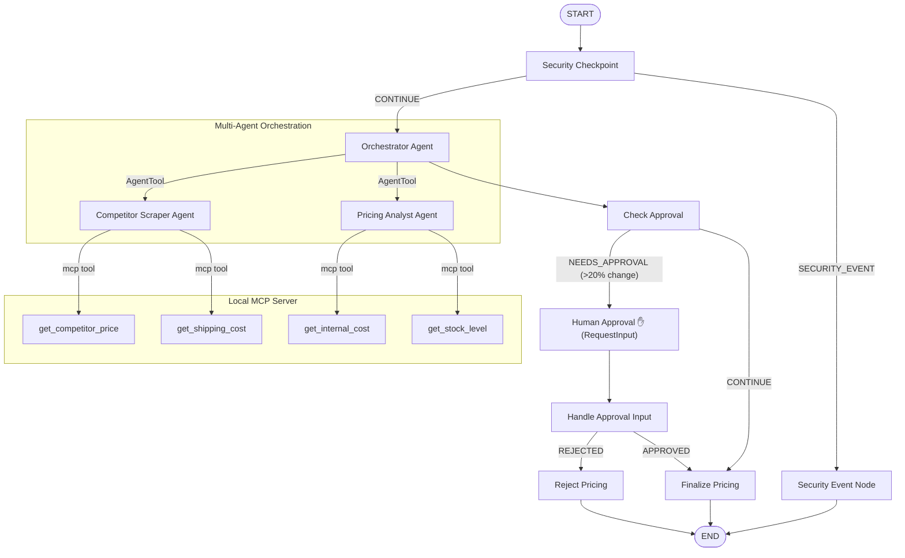

# competitor-pricing-intel — Submission Write-Up

## Problem Statement
In dynamic e-commerce and retail environments, monitoring and adjusting prices to match or outcompete competitors is essential to survive. However, manual pricing analysis is slow, error-prone, and cannot scale across thousands of SKUs. Doing it automatically using simple scripts often fails because:
1. Dynamic competitor pricing relies on complex factors (shipping rates, inventory availability, profit margins).
2. Direct connection of LLMs to internal cost data poses prompt-injection risks, where users can trick an AI into exposing confidential supplier prices or forcing a $0 item price.
3. Completely autonomous pricing adjustments without manager approvals (Human-in-the-Loop) can lead to catastrophic losses if the AI miscalculates or is manipulated.

`competitor-pricing-intel` solves this by building a secure, multi-agent workflow integrated with a local MCP server for tool isolation, protected by a security checkpoint, and governed by a Human-in-the-Loop (HITL) approval gate for pricing changes exceeding 20%.

---

## Solution Architecture

---

## Concepts Used

This project leverages the full power of the Google ADK 2.0 framework and standard Model Context Protocol (MCP) integrations:

1. **ADK 2.0 Workflow Graph**: Exposes the entire pipeline as a state-driven execution graph in [app/agent.py](file:///app/agent.py#L220-L243).
2. **LlmAgent**: Three specialized agents (`orchestrator_agent`, `competitor_scraper_agent`, and `pricing_analyst_agent`) run independently in [app/agent.py](file:///app/agent.py#L56-L108).
3. **AgentTool**: Wraps the scraper and analyst sub-agents as tools in the orchestrator agent ([app/agent.py](file:///app/agent.py#L92-L108)), ensuring the orchestrator retains control and coordinates step execution.
4. **Local MCP Server**: An isolated stdio-based MCP server implemented in [app/mcp_server.py](file:///app/mcp_server.py) using the Python MCP SDK. Tools are dynamically loaded and filtered using `McpToolset` in the agent code.
5. **Security Checkpoint**: Implemented as a deterministic function node at the start of the workflow graph ([app/agent.py](file:///app/agent.py#L115-L172)), protecting the LLMs from malicious prompts and compliance errors.
6. **Agents CLI**: Scaffolded using `agents-cli` in prototype mode (`--adk`), providing local development via `agents-cli playground` or `uv run adk web`.

---

## Security Design

The security model is built on the principle of **Defense-in-Depth**:
* **Input Validation & Prompt Injection Detection**: Before a query reaches the LLM, the `security_checkpoint` node searches for jailbreak attempts (e.g., "ignore previous instructions"). If detected, the flow immediately routes to a terminal block node.
* **PII Redaction**: Any sensitive information like customer email addresses or credit cards is scrubbed and redacted using regexes to protect privacy.
* **Domain Content Restrictions**: Restricts queries matching blacklisted categories (e.g., weapon or drug prices) to ensure the system is only used for company-relevant inventory items.
* **Structured Auditing**: Every execution publishes a structured JSON log reporting the exact security indicators triggered, providing full traceability for security operators.

---

## MCP Server Design

The local MCP server ([app/mcp_server.py](file:///app/mcp_server.py)) decouples business data sources from the reasoning agent. It exposes 4 tools:
1. `get_competitor_price`: Fetches real-time competitor prices for product SKUs.
2. `get_shipping_cost`: Looks up shipping rates for competitor items to allow land-cost calculations.
3. `get_internal_cost`: Retrieves our manufacturing cost and current sale price.
4. `get_stock_level`: Retrieves internal inventory level to assess supply urgency.

---

## Human-in-the-Loop (HITL) Flow

If the suggested price change exceeds a **20% threshold** (calculated as `|recommended_price - current_price| / current_price`), the `check_approval` function node flags the event and redirects the workflow to `human_approval_node`.
* **Mechanism**: The workflow yields a `RequestInput` event which pauses graph execution.
* **User Action**: The manager is prompted to type `approve` or `reject` inside the UI.
* **Resumption**: When the input is submitted, the workflow resumes at `handle_approval_input` to commit the pricing adjustment or abort.

---

## Demo Walkthrough

The project includes 3 test cases to demonstrate all paths:
1. **Auto-Approval**: User requests pricing for `standard widget`. Price adjustments are small ($70.00 current vs $80.00 competitor). The adjustment is auto-approved and finalized immediately.
2. **HITL Prompting**: User requests pricing for `UltraWidget Pro`. Recommended price rises from $120.00 to $145.00 (>20%). The playground UI pauses and prompts the user for approval before updating.
3. **Security Block**: User tries to inject instructions. The checkpoint immediately stops the run and outputs a security error message.

---

## Impact / Value Statement
* **Who benefits**: Retail analysts, category managers, and pricing departments.
* **How**: Auto-scraping and margin recommendations save hours of manual data matching. The security checkpoint and HITL approvals eliminate risks of system misuse and financial losses, making it safe for corporate deployment.
